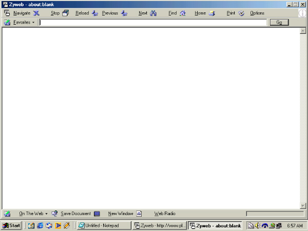

## Zyweb Beta 2\.5\.1

### Description

* I Need Help On The Favorites System Anyone That Would Help E-Mail Me Please..

Web-Browser (Ie Front End) New Features In This Version Include Ability To Save Web-Documents Popup window Control (Instead Of Opening A New IE Window It Open Another Zyweb Window) And A New Web-radio Feature. Enhancements Include A Trimed Down Interface And I Have Imbeded The Flash Move (Flash Required For This Project) And A More Accurate Progressbar. Improvements Over The Previous Vershion Include A New Window Toolbar And Better Printing Management.
 
### More Info
 

             |
---                |---
**Submitted On**   |2000-08-11 16:16:56
**By**             |[Modis Software](https://github.com/Planet-Source-Code/PSCIndex/blob/master/ByAuthor/modis-software.md)
**Level**          |Intermediate
**User Rating**    |4.2 (25 globes from 6 users)
**Compatibility**  |VB 6\.0
**Category**       |[Internet/ HTML](https://github.com/Planet-Source-Code/PSCIndex/blob/master/ByCategory/internet-html__1-34.md)
**World**          |[Visual Basic](https://github.com/Planet-Source-Code/PSCIndex/blob/master/ByWorld/visual-basic.md)
**Archive File**   |[CODE\_UPLOAD88728112000\.zip](https://github.com/Planet-Source-Code/modis-software-zyweb-beta-2-5-1__1-10552/archive/master.zip)

